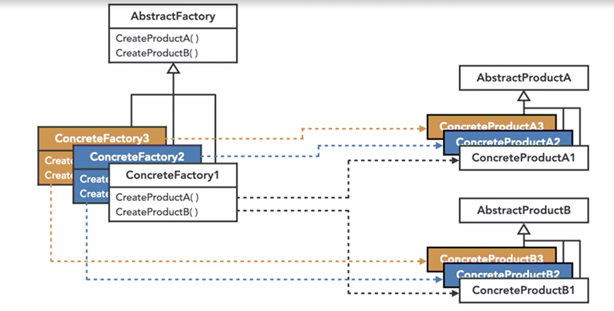

extension of factory pattern

imagine multiple factories making SUV sedan cars

one for CNG cars another for diesel cars another for petrol and one for electric cars

Components developed by one factory may not be compatible with other factory

e.g. engine for petrol SUV cars may not work with electric SUVs

Another practical example

UI theme

dark mode / light mode

each of them have different UI element that are not compatible with each other 

with components like Text Background color

i can have DarkThemeFactory LightThemeFacotry