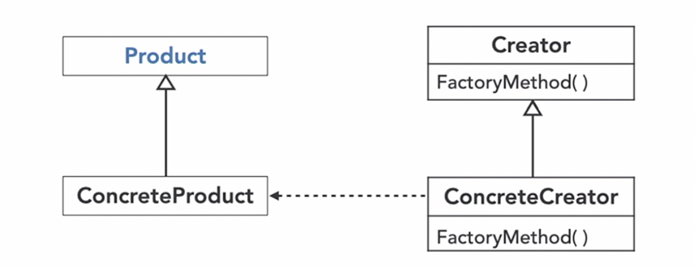

goal is to move the object creation logic away from main program

Provides interface to create object but defers the creation logic to subclasses

Easily add new products easily 

object creation based on some condition/input